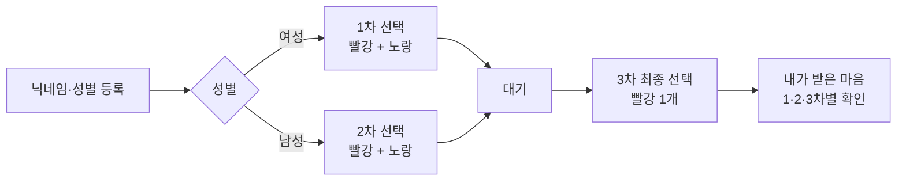

# CNU SOME:ONE PROJECT

> 오프라인 솔로파티의 입장, 단계별 호감 선택, 개인 결과 공개와 운영자 집계를 하나의 모바일 웹으로 연결한 풀스택 프로젝트


[참가자 웹앱](https://maeum-han-jan.b04836ef-c4de-4d92-9db3-39c1e246ccd9.chatgpt.site/) · [관리자 대시보드](https://maeum-han-jan.b04836ef-c4de-4d92-9db3-39c1e246ccd9.chatgpt.site/admin) · [8인 시뮬레이션](https://maeum-han-jan.b04836ef-c4de-4d92-9db3-39c1e246ccd9.chatgpt.site/simulation)

## 프로젝트 개요

`CNU SOME:ONE PROJECT`는 종이 투표로 진행되던 솔로파티의 선택 과정을 모바일 웹앱으로 전환한 프로젝트입니다. 참가자는 별도 앱 설치 없이 링크로 접속해 프로필을 등록하고, 행사 순서에 맞춰 하트를 전달합니다. 운영자는 보호된 관리자 대시보드에서 입장 인원, 제출률, 전체 전달 기록과 최종 상호 선택을 확인합니다.

이 프로젝트는 UI 시안에 그치지 않고 다음 요소를 실제로 연결했습니다.

- 모바일 참가자 인터페이스
- 서버 API와 단계별 비즈니스 규칙 검증
- Cloudflare D1 기반 데이터 영속화
- 참가자별 결과 분리
- ChatGPT 로그인 기반 관리자 접근 제어
- 관리자 집계와 테스트 데이터 초기화
- 공개 URL 배포

## 핵심 사용자 흐름



### 하트의 의미

| 하트 | 의미 | 사용 단계 |
| --- | --- | --- |
| ❤️ 빨간 하트 | 이성적으로 마음이 간다 | 1·2·3차 |
| 💛 노란 하트 | 더 알아가고 싶다 | 1·2차 |

1·2차에서는 두 하트를 서로 다른 사람에게 보내거나 한 사람에게 모두 보낼 수 있습니다. 3차에서는 최종 선택으로 빨간 하트만 보냅니다.

## 주요 기능

### 참가자 웹앱

- 닉네임과 성별을 이용한 간단한 프로필 생성
- 브라우저 세션 토큰을 이용한 재접속 상태 복원
- 성별에 맞는 실제 상대 참가자만 목록에 표시
- 빨간색·노란색 하트의 독립 선택 및 동일인 중복 지정
- 제출 전 확인 화면과 제출 후 변경 방지
- 1·2·3차에 받은 마음을 단계별로 표시
- 본인의 세션으로 조회한 개인 결과만 반환

### 관리자 대시보드

- ChatGPT 로그인 후 허용된 관리자 이메일 검증
- 실제 참가자 수와 남녀 인원 집계
- 단계별 제출 인원과 진행률 표시
- 전체 하트 전달 기록 조회
- 참가자별 수신 결과 확인
- 3차 빨간 하트의 역방향 기록을 비교한 상호 선택 계산
- 테스트 프로필과 선택 기록 초기화
- 샘플 데이터 제외 집계

## 시스템 아키텍처

```mermaid
flowchart TB
    subgraph Client[참가자 모바일 브라우저]
      UI[React 참가자 UI]
      LS[localStorage 세션 토큰]
    end

    subgraph Server[Cloudflare Workers 호환 서버]
      API[/api/app]
      ADMIN[/admin]
      RESET[/api/admin/reset]
    end

    DB[(Cloudflare D1 / SQLite)]
    AUTH[Sign in with ChatGPT]

    UI -->|프로필 생성·선택 제출| API
    LS -->|Bearer Token| API
    API -->|검증·조회·저장| DB
    AUTH --> ADMIN
    ADMIN -->|실제 참가자 집계| DB
    ADMIN --> RESET
    RESET -->|관리자 검증 후 초기화| DB
```

## 기술 스택

| 영역 | 기술 | 선택 이유 |
| --- | --- | --- |
| Frontend | React 19, TypeScript | 상태 기반 화면 전환과 타입 안정성 |
| Full-stack | Vinext, React Server Components | 페이지와 서버 API를 한 프로젝트에서 관리 |
| Build | Vite 8 | 빠른 개발 서버와 Worker 호환 빌드 |
| Backend | Serverless Route Handlers | 별도 서버 운영 없이 API 제공 |
| Database | Cloudflare D1, SQLite | 참가자와 선택 관계를 영구 저장하고 SQL로 집계 |
| Schema | Drizzle ORM / Drizzle Kit | 타입 기반 스키마와 마이그레이션 관리 |
| Admin Auth | Sign in with ChatGPT | 관리자 페이지의 서버 측 신원 확인 |
| Hosting | OpenAI Sites / Cloudflare Workers | 정적 UI, 서버 API, D1 바인딩을 함께 배포 |
| Styling | CSS | 모바일 중심의 맞춤형 인터페이스 구현 |

## 프로젝트 문서

- [전체 시스템 구조](docs/ARCHITECTURE.md)
- [참가자 웹앱 설계](docs/PARTICIPANT_APP.md)
- [관리자 대시보드 설계](docs/ADMIN_DASHBOARD.md)
- [데이터베이스와 API](docs/DATABASE_AND_API.md)
- [보안·개인정보·현재 한계](docs/SECURITY_AND_LIMITATIONS.md)

## 주요 경로

| 경로 | 역할 |
| --- | --- |
| `/` | 프로필 생성, 단계별 선택, 개인 결과 |
| `/admin` | 인증된 운영자용 행사 현황과 결과 |
| `/simulation` | 8인 행사를 가정한 정적 시뮬레이션 |
| `/api/app` | 참가자 생성·상태 조회·선택 저장 |
| `/api/admin/reset` | 관리자 전용 테스트 데이터 초기화 |

## 디렉터리 구조

```text
app/
├── page.tsx                    # 참가자 앱 UI와 상태 흐름
├── api/app/route.ts            # 참가자 API와 서버 검증
├── admin/page.tsx              # 관리자 집계 화면
├── api/admin/reset/route.ts    # 관리자 데이터 초기화 API
├── chatgpt-auth.ts             # 로그인 사용자 해석 및 리다이렉트
├── simulation/page.tsx         # 8인 시뮬레이션
├── globals.css                 # 참가자 화면 스타일
└── admin/                      # 관리자 화면 스타일
db/
├── schema.ts                   # Drizzle 데이터 모델
└── index.ts                    # D1 접근 헬퍼
drizzle/                        # 데이터베이스 마이그레이션
public/                         # 파비콘과 공유 이미지
worker/                         # Cloudflare Worker 진입점
docs/                           # 상세 설계 문서
```

## 로컬 실행

### 요구 사항

- Node.js 22.13 이상
- pnpm 11

```bash
pnpm install
pnpm dev
```

관리자 화면을 로컬에서 사용하려면 저장소에 포함되지 않는 `.dev.vars` 파일을 만듭니다.

```text
ADMIN_EMAIL=your-email@example.com
```

프로덕션 빌드:

```bash
pnpm build
```

## 핵심 설계 결정

1. **참가자 데이터는 D1을 기준 데이터로 사용**하고, 브라우저에는 임의 세션 토큰만 저장했습니다.
2. **행사 규칙을 서버에서도 검증**해 화면 조작만으로 다른 단계나 잘못된 상대에게 제출할 수 없도록 했습니다.
3. **선택 기록을 발신자와 수신자의 관계로 저장**해 개인 결과와 관리자 집계를 동일한 데이터에서 생성합니다.
4. **관리자 인증과 권한 검사를 분리**했습니다. 로그인 성공만으로 관리자가 되는 것이 아니라 서버 환경 변수의 허용 이메일과 다시 비교합니다.
5. **가상 참가자와 실제 참가자를 분리**하고 현재 운영 화면에는 `is_sample = 0`인 실제 입장자만 노출합니다.

## 현재 MVP의 범위

현재 버전은 실제 데이터 저장과 관리자 집계가 가능한 행사 MVP입니다. 다음 기능은 후속 개발 항목입니다.

- 관리자가 1·2·3차를 직접 전환하는 전역 행사 상태
- 관리자의 결과 공개 버튼과 공개 전 잠금
- 행사별 코드와 여러 행사 데이터 분리
- 휴대폰 인증 또는 재입장 코드
- 실시간 푸시 방식의 자동 현황 갱신
- 개인정보 보관 기간과 자동 삭제 정책

## 회고

이 프로젝트를 통해 단순한 선택 UI를 구현하는 것보다, 행사 규칙을 데이터 모델과 서버 검증으로 표현하는 일이 중요하다는 점을 확인했습니다. 특히 참가자 화면과 관리자 화면이 같은 선택 데이터를 서로 다른 권한과 관점으로 읽도록 설계하면서, 인증과 인가의 차이, 관계형 데이터 모델링, 운영 도구의 필요성을 함께 다뤘습니다.

---

**Repository name:** `cnu_some-one_project`
**Service:** 마음, 한 잔
