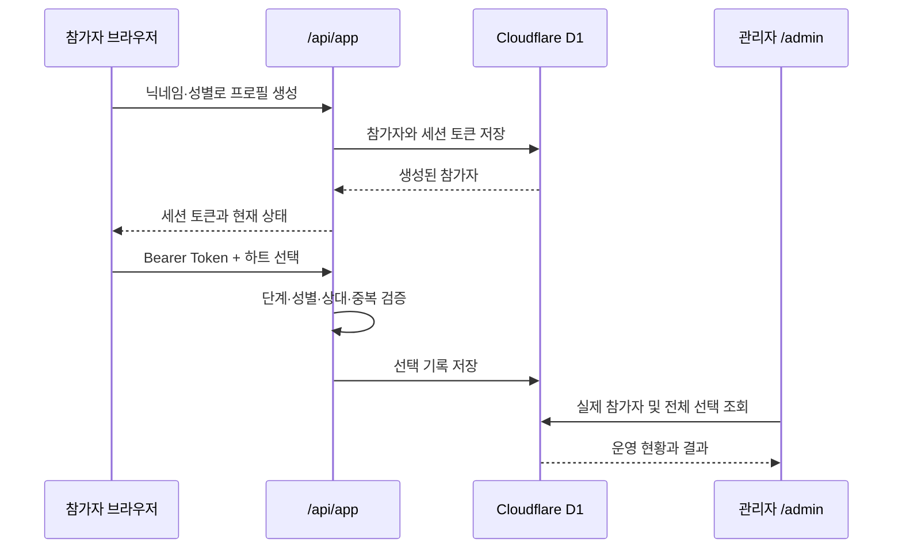

# 시스템 아키텍처

## 1. 전체 구성

이 프로젝트는 참가자용 클라이언트, 서버 API, D1 데이터베이스, 관리자 서버 페이지로 구성됩니다. 별도의 장기 실행 서버를 운영하지 않고 요청이 들어올 때 실행되는 Serverless 구조를 사용합니다.

## 2. 클라이언트 상태

`app/page.tsx`는 `onboarding`, `select`, `confirm`, `between`, `results` 화면 상태를 관리합니다. 서버에서 받은 `completedStages`와 참가자 성별을 기준으로 재접속 시 적절한 화면을 결정합니다.

## 3. 서버 상태

서버의 기준 데이터는 D1입니다. 클라이언트가 전달하는 화면 상태를 신뢰하지 않고 세션 토큰으로 참가자를 다시 조회한 뒤 허용된 단계인지 확인합니다.

## 4. 배포 구조

Vinext가 React 클라이언트, 서버 컴포넌트와 API Route를 Cloudflare Workers 호환 결과물로 빌드합니다. 배포 환경에서는 `DB`라는 논리 바인딩이 실제 Cloudflare D1 데이터베이스에 연결됩니다.

## 5. 데이터 흐름의 분리

- 참가자 API: 현재 세션 참가자에게 필요한 상대 목록과 개인 결과만 반환
- 관리자 페이지: 로그인과 이메일 허용 검사를 통과한 사용자에게 전체 집계 제공
- 시뮬레이션: 실제 데이터베이스와 분리된 정적 예시 데이터 사용
