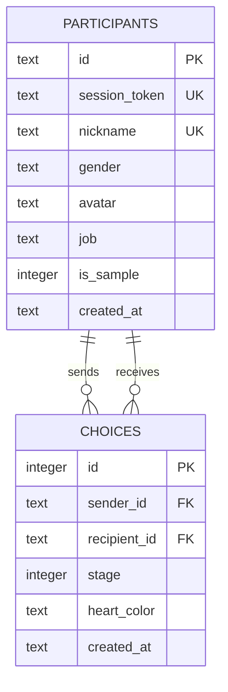

# 데이터베이스와 API

## 1. 데이터 모델



## 2. 무결성 규칙

- 참가자 ID, 세션 토큰과 닉네임은 고유해야 합니다.
- 성별은 `male` 또는 `female`만 허용합니다.
- 단계는 1~3만 허용합니다.
- 하트 색상은 `red` 또는 `yellow`만 허용합니다.
- `(sender_id, stage, heart_color)` 고유 인덱스로 같은 단계·색상의 중복 저장을 방지합니다.
- `(recipient_id, stage)` 인덱스로 개인 결과 조회를 보조합니다.

## 3. API

### `GET /api/app`

`Authorization: Bearer <token>` 헤더로 참가자를 확인하고 현재 프로필, 실제 상대 참가자 목록, 완료 단계와 개인 결과를 반환합니다.

### `POST /api/app` — 프로필 생성

```json
{
  "action": "createProfile",
  "nickname": "참가자닉네임",
  "gender": "female"
}
```

### `POST /api/app` — 선택 제출

```json
{
  "action": "submitChoice",
  "stage": 1,
  "redRecipientId": "participant-id",
  "yellowRecipientId": "participant-id"
}
```

### `POST /api/admin/reset`

인증된 관리자만 실제 참가자와 선택 기록을 초기화할 수 있습니다.

## 4. 오류 응답

- `400`: 입력이나 선택 대상이 잘못됨
- `401`: 세션 토큰이 없거나 프로필을 찾을 수 없음
- `403`: 현재 성별·단계에 허용되지 않은 요청 또는 관리자 권한 없음
- `409`: 닉네임 중복 또는 이미 완료한 단계
- `500`: 데이터베이스 또는 서버 처리 실패
